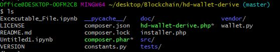
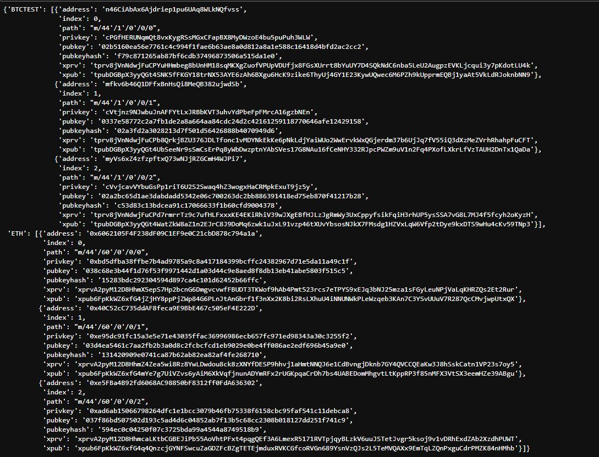
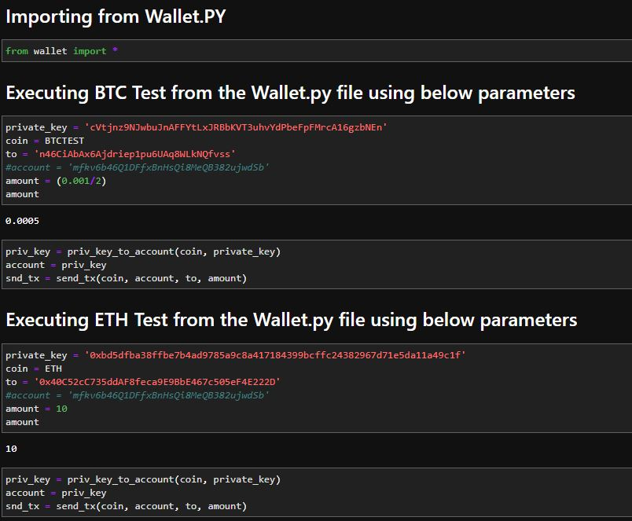
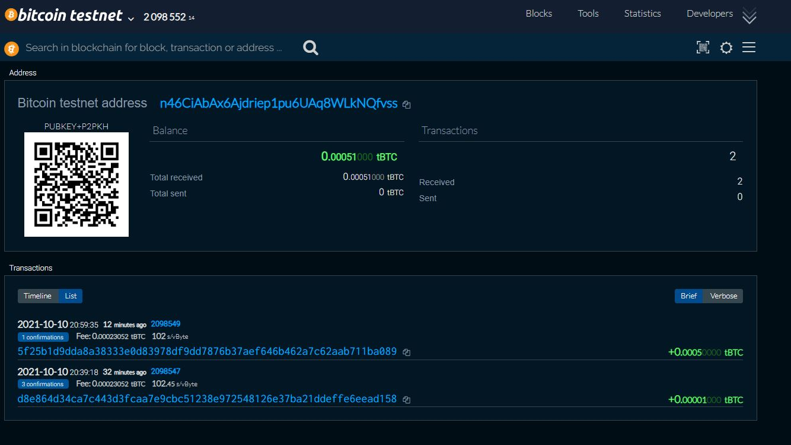
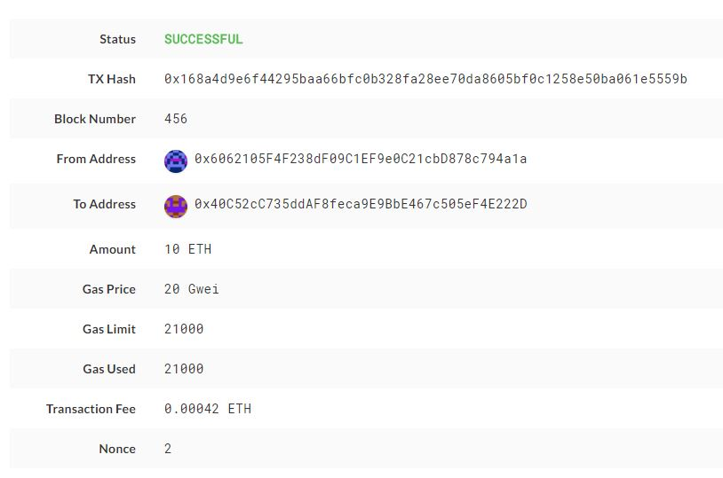

# Multi-coin Python Wallet

This project contains a Python wallet that supports Ethereum and BTC testnet transactions. This uses the BIP44 standard, and leverages the following libraries:

- [`hd-wallet-derive`](https://github.com/dan-da/hd-wallet-derive) BIP44 Command Line tool that supports 300+ coins

- [`bit`](https://ofek.github.io/bit/) Python Bitcoin library

- [`web3.py`](https://github.com/ethereum/web3.py) Python Ethereum library

## Installation

You will need PHP and Python 3 on your system.

First, install Python dependencies using pip:

`pip install -r requirements.txt`

Then, clone and install `hd-wallet-derive`. Instructions are also available [here](https://github.com/dan-da/hd-wallet-derive#installation-and-running).

```bash
git clone https://github.com/dan-da/hd-wallet-derive
cd hd-wallet-derive
php -r "readfile('https://getcomposer.org/installer');" | php
php composer.phar install
ln -s hd-wallet-derive.php ../derive
cd ..
```
## Make sure all the files are in the hd-wallet-derive folder for this program to work


## The address that will be used to send transaction needs to be from the hd wallet for both BTCTEST and ETH


## To execute the program use the "Exceutable_file.ipynb" in the hd-wallet-derive folder


## BTC Transaction confirmation
Two transactions were sent for testing purposes and one of it is of "0.0005"


## ETH Transaction confirmation
Two transactions were sent for testing purposes and one of it is of 10 ETH

